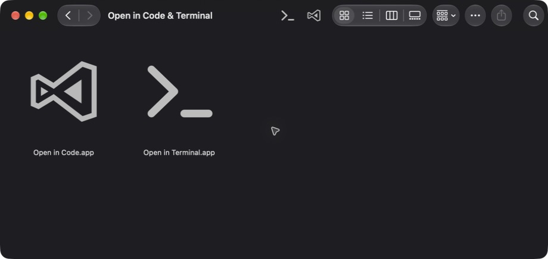

<div align="center">

# Mac OpenIn

### Open Finder folders in Code or Terminal.

**macOS 27 tested · Apple Silicon only · Two apps in one DMG**

[](#macos-27)
[](#requirements)
[](https://github.com/Sh7ne/Mac-OpenIn/actions/workflows/build.yml)
[](LICENSE)

**[Download the DMG →](https://github.com/Sh7ne/Mac-OpenIn/releases/latest)** · [Install](#install) · [Build from source](#build-from-source)



*One DMG contains Open in Code.app and Open in Terminal.app. Actual screenshot on macOS 27.*

</div>

## Two buttons. Your current folder.

| App | What it opens |
| --- | --- |
| **Open in Code.app** | The folder in Visual Studio Code |
| **Open in Terminal.app** | A Terminal window at the folder |

Select a **folder** to open it. Select a **file** to open its containing folder.
Select **nothing** to use the front Finder window. With no available Finder folder,
the apps use Desktop.

Both apps use transparent icons that fit the Finder toolbar. Paths containing spaces,
Chinese characters, quotes, or shell characters are passed as filenames. No `code`
command-line launcher or shell setup is needed.

## macOS 27

**Supported and tested on macOS 27.0 with Apple Silicon.** The screenshot above was
captured on macOS 27.0, build `26A428`.

- Transparent toolbar icons, without an extra rounded background.
- Open the current Finder folder or the selected file’s containing folder.
- Terminal sits immediately to the left of Code in the toolbar.

> **Dragging an app into the toolbar on macOS 27**
>
> If Command-drag does not work, right-click the toolbar and choose **Text Only**.
> Drag the apps into place, then switch back to **Icon Only**. This workaround was
> verified on the macOS 27 setup shown above.

## Install

1. Download **`Open-in-2.1-arm64.dmg`** from the [latest release](https://github.com/Sh7ne/Mac-OpenIn/releases/latest).
2. Open the DMG. **Both `.app` files are inside the same disk image.**
3. Copy the apps into `/Applications/Utilities` using Finder.
4. Open each app once and allow access to Finder when macOS asks.
5. Command-drag the apps into the Finder toolbar: **Terminal on the left, Code on the right**.

Each app also has an individual ZIP download on the release page. Use Archive Utility
or `ditto` to extract ZIPs so the transparent icon metadata is preserved.
When replacing an older app, remove its toolbar shortcut and drag the new app into place.

### Requirements

| | |
| --- | --- |
| Processor | **Apple Silicon (arm64)** — Intel Macs are not supported |
| macOS | 12.1 or later; **macOS 27.0 tested** |
| Open in Code | Visual Studio Code installed |
| Open in Terminal | Terminal, included with macOS |
| Signing | Ad hoc signed; not notarized |

## Build from source

Install full Xcode, then run:

```sh
git clone https://github.com/Sh7ne/Mac-OpenIn.git
cd Mac-OpenIn
sh scripts/build.sh
```

| Output | Location |
| --- | --- |
| Both apps | `build/Build/Products/Release/` |
| One DMG containing both apps | `build/Open-in-2.1-arm64.dmg` |
| Individual ZIPs | `build/Open-in-{Code,Terminal}-2.1-arm64.zip` |

Use `sh scripts/build.sh Debug` for both Debug builds, or
`sh scripts/build.sh Release Code` / `sh scripts/build.sh Release Terminal` for one app.

One Xcode project has two targets that share the implementation and build settings.
CI runs Clang static analysis and builds both configurations with compiler warnings
as errors. Tagged releases publish the DMG and ZIPs automatically.

<details>
<summary><strong>Transparent icons and signature verification</strong></summary>

The build preserves the existing ICNS artwork as a custom Finder icon. Copy apps
with Finder or `ditto` to keep the resource fork and Finder metadata.

If another copy tool strips the custom icon, restore it from the repository root:

```sh
sh scripts/preserve-finder-icon.sh \
  "/Applications/Utilities/Open in Code.app" Monterey.icns
sh scripts/preserve-finder-icon.sh \
  "/Applications/Utilities/Open in Terminal.app" Terminal/Terminal.icns
```

Xcode’s signed intermediates in `build/DerivedData` pass strict verification.
Finished apps pass `codesign --verify`; `--strict` rejects the Finder metadata
used for custom icons.

</details>

## License & attribution

Mac OpenIn is independently maintained by **Sh7ne** and is derived from
[OpenInCode by Sertac Ozercan](https://github.com/sozercan/OpenInCode).
The original project was released under the **MIT License**, and this project
continues under the same license.

**Original copyright: Copyright (c) 2016 Sertac Ozercan.**

The original copyright notice and complete MIT permission and warranty notice are
retained in [LICENSE](LICENSE). Redistribution of this software, including modified
copies, must retain that copyright and permission notice. Detaching the GitHub fork
relationship does not change these license terms or the project's origin.

The minimal Finder declarations derive from the original `Finder.h`, which credited
[BetterInfo](https://github.com/davedelong/BetterInfo/blob/master/Finder.h).
The original Code icon is retained; its PNG-to-ICNS conversion was credited to
[Aconvert](https://www.aconvert.com/image/).
