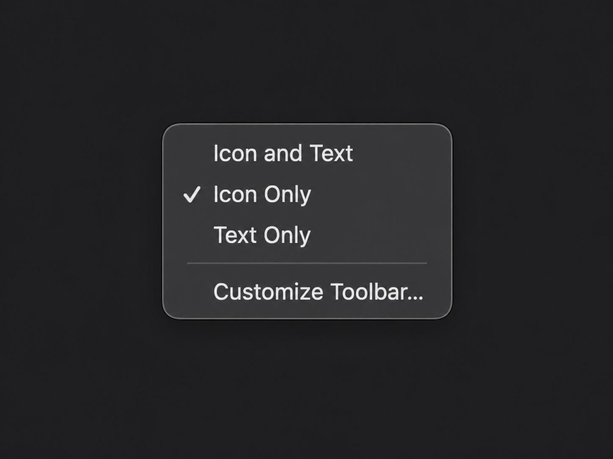

<div align="center">

# Mac OpenIn

[English](README.md) · **简体中文**

### 一键在 Code 或 Terminal 中打开 Finder 文件夹。

**macOS 27 实测 · 仅支持 Apple Silicon · 一个 DMG，两个 App**

[](#macos-27)
[](#系统要求)
[](https://github.com/Sh7ne/Mac-OpenIn/actions/workflows/build.yml)
[](LICENSE)

**[下载 DMG →](https://github.com/Sh7ne/Mac-OpenIn/releases/latest)** · [安装](#安装) · [从源码构建](#从源码构建)


*同一个 DMG 内包含 Open in Code.app 和 Open in Terminal.app。上图为 macOS 27 实拍。*

</div>

## 两个按钮，打开当前文件夹

| App | 功能 |
| --- | --- |
| **Open in Code.app** | 在 Visual Studio Code 中打开文件夹 |
| **Open in Terminal.app** | 打开 Terminal，并进入该文件夹 |

选中**文件夹**时打开该文件夹；选中**文件**时打开它所在的文件夹。
**没有选中项目**时，打开最前方 Finder 窗口中的文件夹。
没有可用的 Finder 文件夹时，使用桌面目录。

两个 App 都使用适合 Finder 工具栏的透明图标。支持含空格、中文、引号或
Shell 特殊字符的路径，路径会作为文件名传递。无需安装 `code` 命令行启动器，
也无需配置 Shell。

## macOS 27

**支持 macOS 27，已在搭载 Apple Silicon 的 macOS 27.0 上实测。**
上方截图拍摄于 macOS 27.0，系统构建版本为 `26A428`。

- 工具栏图标保持透明，不会额外出现一圈圆角背景。
- 可打开当前 Finder 文件夹，或选中文件所在的文件夹。
- 工具栏中 Terminal 位于 Code 左边。

> **在 macOS 27 中把 App 拖入 Finder 工具栏**
>
> 可能需要先**右键点击 Finder 工具栏，选择 Text Only（只显示文字）**，
> 然后**按住 Command（⌘）键，将 App 拖入工具栏**。
> 即使已经切到 Text Only，拖动时也要一直按住 Command。
> 两个 App 都添加完成后，可以切回 **Icon Only（只显示图标）**。
> 这一方法已在上图的 macOS 27 环境中验证。

<p align="center">
  
  <br>
  <em>在 Finder 工具栏右键菜单中选择 Text Only（只显示文字），再按住 Command（⌘）将 App 拖入工具栏。</em>
</p>

## 安装

1. 从[最新 Release](https://github.com/Sh7ne/Mac-OpenIn/releases/latest) 下载 **`Open-in-2.1-arm64.dmg`**。
2. 打开 DMG，**两个 `.app` 文件都在同一个安装盘里**。
3. 使用 Finder 将两个 App 复制到 `/Applications/Utilities`（应用程序 → 实用工具）。
4. 分别打开一次；macOS 询问时，允许 App 访问 Finder。
5. macOS 27 上可能需要先右键点击 Finder 工具栏，选择 **Text Only（只显示文字）**。
6. **按住 Command（⌘）键**，将两个 App 分别拖入 Finder 工具栏：**Terminal 在左，Code 在右**。
7. 添加完成后，可以右键点击工具栏，切回 **Icon Only（只显示图标）**。

Release 页面也提供两个 App 各自的 ZIP。请使用系统“归档实用工具”或 `ditto`
解压，以保留透明图标的元数据。替换旧版 App 时，先移除旧的工具栏快捷方式，
再将新版 App 拖入。

### 系统要求

| 项目 | 要求 |
| --- | --- |
| 处理器 | **Apple Silicon（arm64）**，不支持 Intel Mac |
| macOS | 12.1 或更高版本；**macOS 27.0 已实测** |
| Open in Code | 需要安装 Visual Studio Code |
| Open in Terminal | 使用 macOS 自带的 Terminal |
| 签名 | 使用 ad hoc 签名，未经公证 |

## 从源码构建

安装完整版 Xcode，然后运行：

```sh
git clone https://github.com/Sh7ne/Mac-OpenIn.git
cd Mac-OpenIn
sh scripts/build.sh
```

| 构建产物 | 位置 |
| --- | --- |
| 两个 App | `build/Build/Products/Release/` |
| 包含两个 App 的单个 DMG | `build/Open-in-2.1-arm64.dmg` |
| 各自的 ZIP | `build/Open-in-{Code,Terminal}-2.1-arm64.zip` |

运行 `sh scripts/build.sh Debug` 可构建两个 App 的 Debug 版本。
仅构建其中一个时，使用 `sh scripts/build.sh Release Code` 或
`sh scripts/build.sh Release Terminal`。

一个 Xcode 项目包含两个 Target，共用实现代码和构建配置。
CI 会运行 Clang 静态分析，并构建 Debug 和 Release，将编译警告视为错误。
推送版本标签后，会自动将 DMG 和 ZIP 发布到 GitHub Releases。

<details>
<summary><strong>透明图标与签名验证</strong></summary>

构建脚本会将现有 ICNS 图案保存为 Finder 自定义图标。
使用 Finder 或 `ditto` 复制 App，可以保留资源分支和 Finder 元数据。

如果其他复制工具丢失了自定义图标，可以在仓库根目录运行以下命令恢复：

```sh
sh scripts/preserve-finder-icon.sh \
  "/Applications/Utilities/Open in Code.app" Monterey.icns
sh scripts/preserve-finder-icon.sh \
  "/Applications/Utilities/Open in Terminal.app" Terminal/Terminal.icns
```

`build/DerivedData` 中由 Xcode 签名的中间产物可以通过严格签名验证。
最终 App 可以通过 `codesign --verify`；`--strict` 会拒绝自定义图标所需的
Finder 元数据。

</details>

## 许可证与来源署名

Mac OpenIn 由 **Sh7ne** 独立维护，衍生自
[Sertac Ozercan 的 OpenInCode](https://github.com/sozercan/OpenInCode)。
原项目采用 **MIT License**，本项目继续使用同一许可证。

**原始版权声明：Copyright (c) 2016 Sertac Ozercan.**

[LICENSE](LICENSE) 中保留了原始版权声明，以及完整的 MIT 授权和免责声明。
再次分发本软件（包括修改后的版本）时，必须保留该版权与许可声明。
解除 GitHub 的 fork 关系，不会改变这些许可条款或项目来源。

精简后的 Finder 接口声明来自原项目的 `Finder.h`，其注明来源为
[BetterInfo](https://github.com/davedelong/BetterInfo/blob/master/Finder.h)。
本项目保留了原有 Code 图标；原项目注明使用
[Aconvert](https://www.aconvert.com/image/) 将 PNG 转换为 ICNS。
